# Data Analytics Migration to Tableau

# Table of Contents
1. [Introduction](#introduction)
2. [Setting up the environment](#Setting-up-the-environment)
3. [Data Wrangling and cleaning](#Data-wrangling-and-cleaning)
    - [Loading the CSV data files in to Pandas dataframes](#Loading-the-CSV-data-files-in-to-Pandas-dataframes)
    - [Data Cleaning](#Data-Cleaning)
    - [Data Integration](#Data-integration)
    - [Exporting the data to a combined_data.csv file](#Exporting-the-data-to-a-combined-data-csv-file)
4. [PostgreSQL RDS data import and reporting](#PostgreSQL-RDS-data-import-and-reporting)
5. [Integrating Tableau Desktop with PostgreSQL RDS](#Integrating-Tableau-Desktop-with-PostgreSQL-RDS)
6. [Creating Tableau Reports](#Creating-Tableau-Reports)
7. [Installation Instructions](#Installation-Instructions)
8. [Usage Instructions](#Usage-Instructions)
9. [License Information](#License-Information)
    
## Introduction 

This project was built to improve my skills as a data analyst regarding the key aspects of data cleaning, integration and reporting. In this scenario, I am a data analyst working for Skyscanner and my goal is to migrate existing data analytics tasks from an Excel-based manual system into interactive Tableau reports. This allows for the large datasets to explored, and statistical questions answered in a format that can be understood easier by both data analysts and other employees of the company. 

## Setting up the environment 

In this project, I use GitHub to track changes to my code and save them online in a GitHub repo. I also have some services running in the cloud, so I set up an AWS account and created an RDS instance and S3 bucket export my csv files.

## Data wrangling and cleaning 

### Loading the CSV data files in to Pandas dataframes

In this step, I prepare the flight data for analysis by exploring, creating and integrating the various data files and creatign a final, integrated master file. First, I downloaded the CSV data files. Next, I opened Visual Studio Code, created a new flights.py file and used Pandas to load all the USA flights data files. I turned each CSV file into a separate dataframe (so that one dataframe corresponds to one year's data). Finally I needed to check that the data was imported successfully.

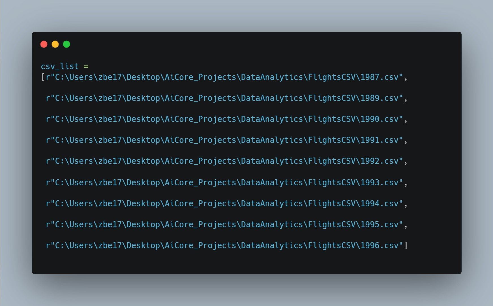

### Data cleaning

Using Pandas, I printed the number of records that contain NULL values in any of their columns using Panda's isnull() and isna() functions. Then, I removed any columns that contain NULL or NA values in all of their records. Finally, for any records that still contained NULL or NA fields, I replaced them with zeros. I also checked the data types of every column and made sure that they had the same format. For example, I converted all of the "Distance" column data to float64 data types. 

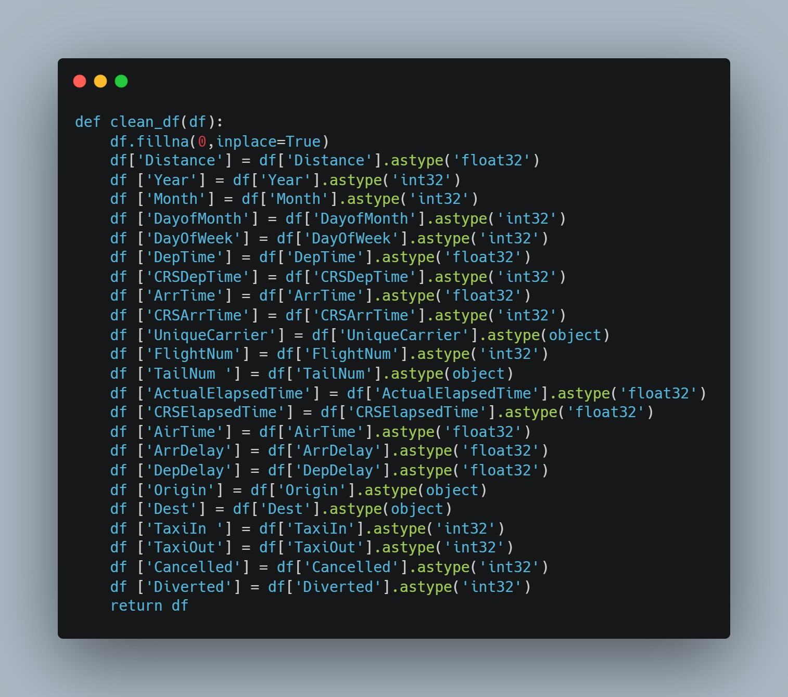

The data in the csv files were flight data, from the year 1987 to 1996, with each year having its own csv file. These are some of the columns within the dataset:

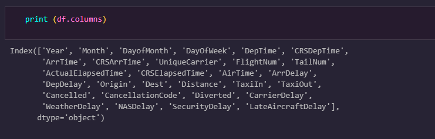

### Data integration

Using Pandas, I integrated all of the dataframes together into one master dataframe.
I made sure all dataframes had the same number of columns, and that each of the column types were the same.

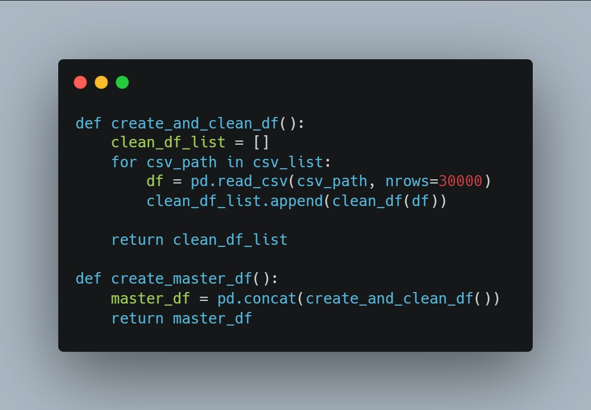

### Exporting the data to a combined_data.csv file
Using Pandas, I exported the final master dataframe into one file called combined_data.csv. I ensured that the file contains header titles for each column. Using the command line interface, I copied the file to my S3 bucket using the aws s3 cp command. I finally downloaded a copy from AWS S3 to my local machine.

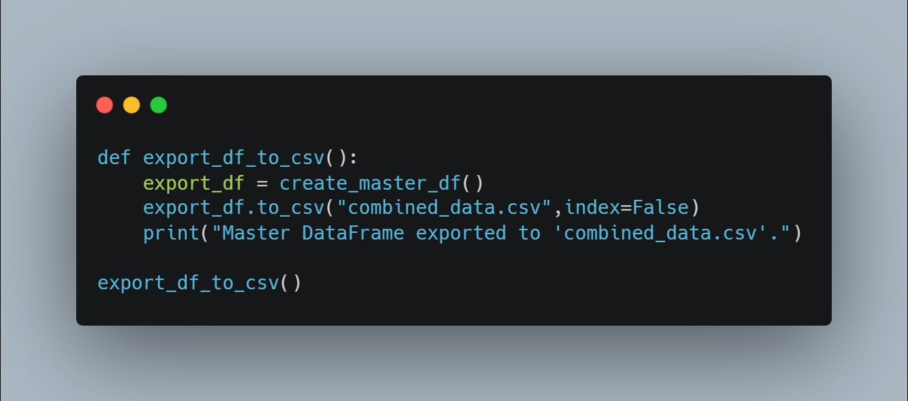

## PostgreSQL RDS data import and reporting  

With my combined_data.csv ready, I could now connect pgAdmin to the PostgreSQL RDS database in the AWS console. In pgAdmin I created a new server called production_server and connected that to the PostgreSQL RDS database using the endpoint. Within the server I created a database called flights_analytics_database and within that database, a table called flights. This table has the same number of columns and the same column types as those in the combined_data.csv file, but I added an extra column called id as the primary key. I could then import the combined_data.csv file into the database. In the properties window that pops-up, made sure to select Import, csv as the format, (,) as the delimiter, and enabled Header. On the Columns tab at the top of the menu I removed the id column from the list of columns to import (otherwise I would get an error).

I could now calculate some statistics: 
How many total records does the table contain? Does it have the same number of records as those in the combined_data.csv file?

Which year had the most number of total inbound and outbound flights? Which country is the most popular destination for flights?

## Integrating Tableau Desktop with PostgreSQL RDS 

In this milestone, I downloaded and installed a 14 day free trial of Tableau Desktop before configuring the PostgreSQL connector and connecting it to my flights_analytics_database RDS. The settings for this are the same as the ones Iused earlier to connect pgAdmin4 to PostgreSQL (same endpoint, username and password).

## Creating Tableau Reports 

For the final milestone, it was time to create a variety of Tableau Reports before exporting to Github. I created Tableau Reports that displays the historical data for the highest flight destinations, the average distance that airplanes travel for all flights (the overall average) for each carrier, the top most used flight numbers, and a treemap showing:

Historical data for the highest flight destinations

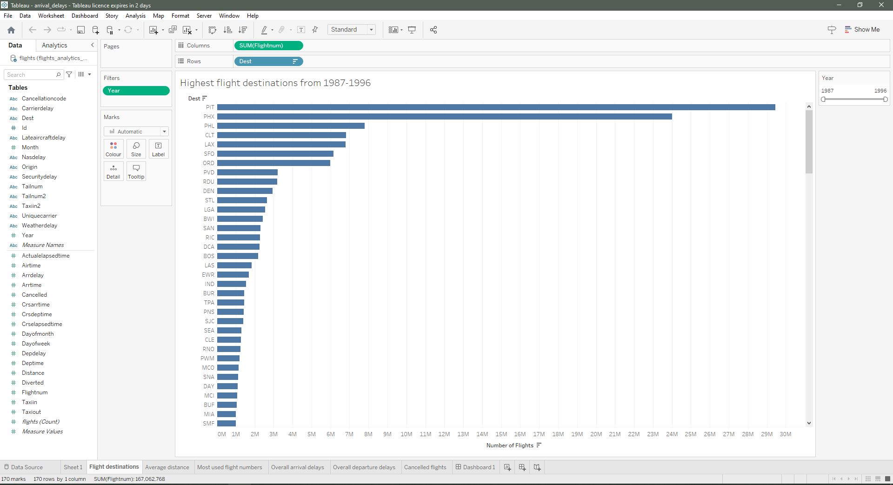

Average distance that airplanes travel for all flights (the overall average) for each carrier

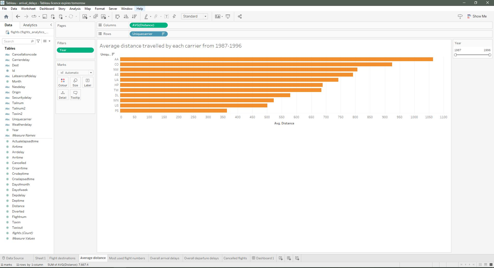

Top most used flight numbers

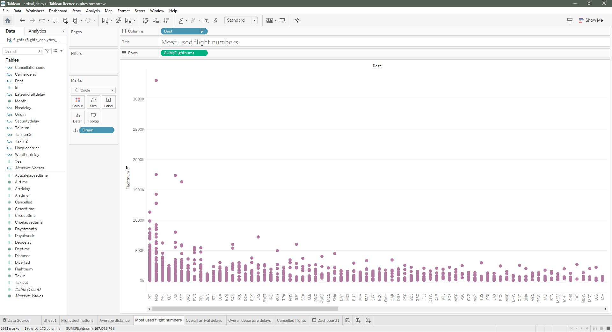

Which airport has the highest overall arrival delay for all flights for all years?

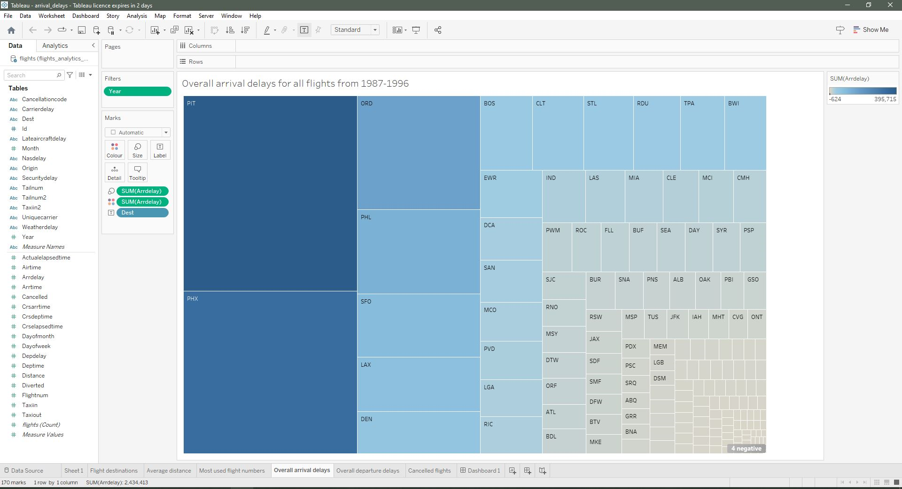

Which airport has the overall highest average departure delay for all flights for all years?

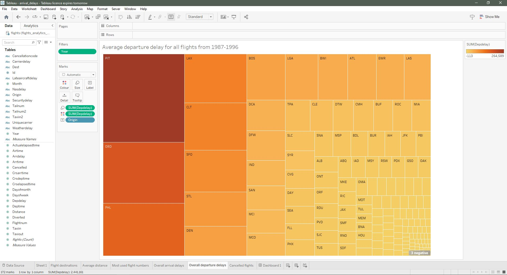

Which airport has the highest number of cancelled flights for all years?

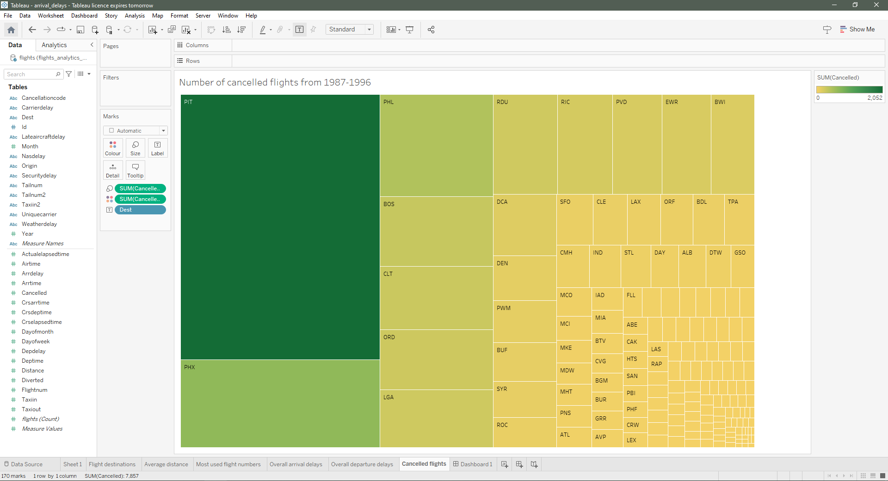

## Installation instructions

To carry out section 2 of this project, you will need to have an AWS account, and VSCode installed on your machine. In VSCode you will need panda packages installed.

## Usage Instructions 

## License information 

TBC

